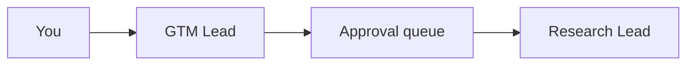

# Mermaid diagram

Files: <code>*.mermaid</code>, <code>*.mmd</code>.

Cabinet renders Mermaid files as diagrams. Open a `.mermaid` file in the sidebar — it shows the rendered diagram with a <mark data-color="yellow">source toggle</mark> to switch between the picture and the text.

## Live example

The diagram below is rendered from [`agent-loop.mermaid`](./agent-loop.mermaid) — a real file in this docs cabinet, rendered live at page-load with the same `mermaid.js` Cabinet uses.

<div data-demo="mermaid-render" data-caption="Same source as the file in this folder."></div>

## Why diagram-as-text matters

- <span class="tx-accent">Source-controlled.</span> A `.mermaid` file is a few lines of plain text. `git diff` shows what changed.
- <span class="tx-accent">Agent-friendly.</span> An agent can write a Mermaid diagram by writing text. No GUI required.
- <span class="tx-accent">Re-themeable.</span> The same source renders in light or dark mode automatically.

## Common diagram types

Mermaid supports a lot of shapes:

| Type | Use |
| --- | --- |
| `flowchart` | System diagrams, agent loops, decision flows. |
| `sequenceDiagram` | API calls, hand-offs between agents. |
| `gantt` | Project timelines. |
| `stateDiagram-v2` | State machines, lifecycle diagrams. |
| `classDiagram` | Schemas, type relationships. |
| `gitGraph` | Branch and merge stories. |
| `mindmap` | Brainstorms, hierarchies. |

## Inline mermaid in markdown

You can also drop mermaid into a markdown page with a fenced block:

````markdown

````

Cabinet renders it inline. Same look as a standalone `.mermaid` file.

## Read on

- [Source code](../source-code/) — for any other text-based file format.
- [Markdown editor](../../editor/) — for embedding mermaid blocks in pages.
